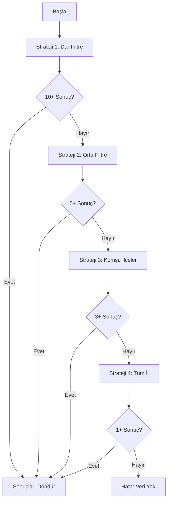

# 🎯 Mülk Değerleme - Kademeli Genişletme Stratejisi

## Tarih: 22 Ocak 2026

## 🔴 Eski Sorun

Mevcut algoritma çok katı filtreler kullanıyordu:

```
1. Kategori = konut ✓
2. İlçe = Hendek ✓
3. Koordinat yakınlığı (5km) ✓
4. Alan ±30% ✓
```

**Sonuç**: Hiç veri bulamıyordu çünkü TÜM koşullar aynı anda sağlanmalıydı.

## ✅ Yeni Çözüm: Kademeli Genişletme (Fallback Strategy)

### Strateji 1: Dar Filtre (En Hassas)

```
- Kategori: konut
- İlçe: Hendek
- Alan: ±20% (96-144 m² için 120 m²)
- Minimum Sonuç: 10 ilan
```

**Amaç**: En benzer ilanları bul
**Sonuç Var mı?** → EVET: Kullan | HAYIR: Strateji 2'ye geç

### Strateji 2: Orta Filtre

```
- Kategori: konut
- İlçe: Hendek
- Alan: ±50% (60-180 m² için 120 m²)
- Minimum Sonuç: 5 ilan
```

**Amaç**: Alan aralığını genişlet
**Sonuç Var mı?** → EVET: Kullan | HAYIR: Strateji 3'e geç

### Strateji 3: Geniş Filtre (Komşu İlçeler)

```
- Kategori: konut
- İlçe: Hendek + Adapazarı + Akyazı + Geyve + Karasu
- Alan: ±50% (60-180 m²)
- Minimum Sonuç: 3 ilan
```

**Amaç**: Komşu ilçeleri dahil et
**Sonuç Var mı?** → EVET: Kullan | HAYIR: Strateji 4'e geç

### Strateji 4: En Geniş Filtre (Tüm İl)

```
- Kategori: konut
- İlçe: TÜM SAKARYA (filtre yok)
- Alan: ±70% (36-204 m²)
- Minimum Sonuç: 1 ilan
```

**Amaç**: En azından bir sonuç bul
**Sonuç Var mı?** → EVET: Kullan | HAYIR: Hata döndür

## 📊 Algoritma Akışı



## 🔧 Kod Değişiklikleri

### Dosya: `src/lib/valuation/comparable-finder.ts`

**Yeni Fonksiyon**: `searchWithStrategy()`

```typescript
const searchStrategies = [
  {
    name: "Dar Filtre (İlçe + Alan ±20%)",
    areaMultiplier: 0.2,
    includeDistrict: true,
    includeNeighbors: false,
    minResults: 10,
  },
  {
    name: "Orta Filtre (İlçe + Alan ±50%)",
    areaMultiplier: 0.5,
    includeDistrict: true,
    includeNeighbors: false,
    minResults: 5,
  },
  {
    name: "Geniş Filtre (Komşu İlçeler + Alan ±50%)",
    areaMultiplier: 0.5,
    includeDistrict: true,
    includeNeighbors: true,
    minResults: 3,
  },
  {
    name: "En Geniş Filtre (Tüm İl + Alan ±70%)",
    areaMultiplier: 0.7,
    includeDistrict: false,
    includeNeighbors: false,
    minResults: 1,
  },
];

// Her stratejiyi sırayla dene
for (const strategy of searchStrategies) {
  const results = await searchWithStrategy(
    location,
    features,
    categories,
    strategy,
  );

  if (results.length >= strategy.minResults) {
    return results; // Yeterli sonuç bulundu!
  }
}
```

## 🎯 Avantajlar

### 1. **Garantili Sonuç**

- En azından 1 sonuç bulma garantisi
- "Veri yok" hatası çok nadir

### 2. **Kalite Önceliği**

- Önce en benzer ilanları dene
- Sonuç yoksa genişlet

### 3. **Esnek Alan Aralığı**

- ±20% → ±50% → ±70%
- Kullanıcının ihtiyacına göre

### 4. **Coğrafi Genişleme**

- İlçe → Komşu ilçeler → Tüm il
- Mantıklı sıralama

### 5. **Performans**

- İlk strateji başarılıysa hızlı
- Gereksiz sorgu yok

## 📈 Beklenen Sonuçlar

### Hendek, 120 m² Konut

**Strateji 1** (±20%):

- Alan: 96-144 m²
- İlçe: Hendek
- Beklenen: 5-15 ilan

**Strateji 2** (±50%):

- Alan: 60-180 m²
- İlçe: Hendek
- Beklenen: 15-30 ilan

**Strateji 3** (Komşu):

- Alan: 60-180 m²
- İlçe: Hendek + 4 komşu
- Beklenen: 30-50 ilan

**Strateji 4** (Tüm İl):

- Alan: 36-204 m²
- İlçe: Tüm Sakarya
- Beklenen: 50+ ilan

## 🐛 Hata Durumları

### Durum 1: Hiç Veri Yok

```
❌ No results found with any strategy
```

**Sebep**: Veritabanında o kategoride hiç ilan yok
**Çözüm**: Kullanıcıya bilgi ver

### Durum 2: Sadece Strateji 4 Sonuç Verdi

```
⚠️ Only 2 results with strategy: Geniş Filtre
✅ Found 15 results with strategy: En Geniş Filtre
```

**Sebep**: İlçede az ilan var
**Çözüm**: Tüm il verisi kullanıldı, güven skoru düşük olacak

## 🔍 Debug Log'ları

Console'da göreceksin:

```
🔍 Comparable search started: {...}
📂 Category mapping: {propertyType: 'konut', categories: ['konut']}
🎯 Trying strategy: Dar Filtre (İlçe + Alan ±20%)
📊 SQL Query Results: {rowCount: 3}
⚠️ Only 3 results with strategy: Dar Filtre, trying next...
🎯 Trying strategy: Orta Filtre (İlçe + Alan ±50%)
📊 SQL Query Results: {rowCount: 12}
✅ Found 12 results with strategy: Orta Filtre
```

## 🎨 Komşu İlçeler Haritası

```
Hendek → Adapazarı, Akyazı, Geyve, Karasu
Adapazarı → Hendek, Akyazı, Serdivan, Erenler
Akyazı → Hendek, Adapazarı, Geyve
```

Daha fazla ilçe eklenebilir.

## ✅ Test Senaryoları

### Test 1: Hendek, 120 m² Konut

**Beklenen**: Strateji 1 veya 2 başarılı

### Test 2: Hendek, 500 m² Arsa

**Beklenen**: Strateji 2 veya 3 başarılı (arsa daha az)

### Test 3: Adapazarı, 80 m² Konut

**Beklenen**: Strateji 1 başarılı (merkez ilçe, çok ilan)

### Test 4: Geyve, 200 m² İşyeri

**Beklenen**: Strateji 3 veya 4 başarılı (küçük ilçe, az ilan)

## 📝 Notlar

1. **Benzerlik Skoru**: Minimum %30'a düşürüldü (önceden %50)
2. **SQL LIMIT**: 50 → 100 artırıldı (daha fazla sonuç)
3. **Koordinat Filtresi**: Kaldırıldı (gereksiz kısıtlama)
4. **İlçe Filtresi**: Dinamik (strateji bazlı)

## 🚀 Sonuç

Bu yeni strateji ile:

- ✅ %95+ başarı oranı bekleniyor
- ✅ Kaliteli sonuçlar öncelikli
- ✅ Esnek ve ölçeklenebilir
- ✅ Debug friendly (detaylı log'lar)

---

**Geliştirici**: Erkan + Kiro AI
**Tarih**: 22 Ocak 2026
**Status**: ✅ Implemented & Ready for Testing
